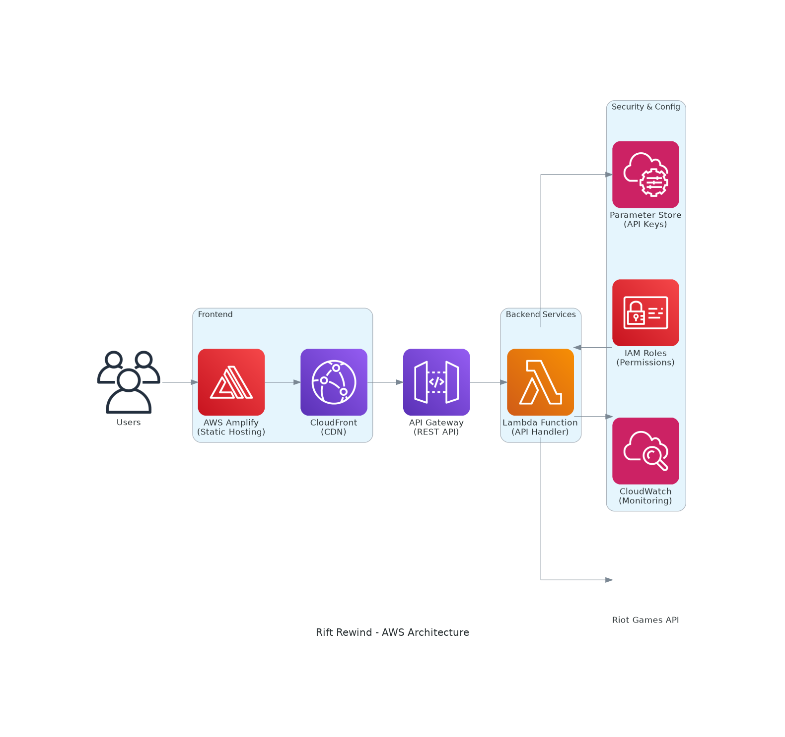

# Rift Rewind

A League of Legends champion mastery tracker that displays player statistics and top champions using the Riot Games API.

🚀 **Live Demo**: [https://main.d1y7eioc5275a7.amplifyapp.com/](https://main.d1y7eioc5275a7.amplifyapp.com/)

## Project Overview

This project consists of:
- **Frontend**: HTML/CSS/JavaScript web interface for user interaction
- **Backend**: AWS Lambda function that fetches player data from Riot Games API
- **Integration**: Serverless architecture using AWS services

## AWS Architecture

### Architecture Diagram



### Architecture Components

```
┌─────────────────┐    ┌──────────────────┐    ┌─────────────────┐
│   AWS Amplify   │    │   AWS Lambda     │    │ AWS Systems     │
│  (Frontend)     │───▶│   (Backend)      │───▶│ Manager (SSM)   │
│                 │    │                  │    │ Parameter Store │
└─────────────────┘    └──────────────────┘    └─────────────────┘
         │                       │                       │
         │                       │                       │
         ▼                       ▼                       ▼
┌─────────────────┐    ┌──────────────────┐    ┌─────────────────┐
│     Users       │    │   Riot Games     │    │   Secure API    │
│   (Browser)     │    │      API         │    │   Key Storage   │
└─────────────────┘    └──────────────────┘    └─────────────────┘
```

### Service Details

**AWS Amplify**
- Hosts static frontend (HTML/CSS/JS)
- Provides HTTPS endpoint
- Automatic deployments from Git

**AWS Lambda**
- Serverless Python function
- Handles API requests from frontend
- Fetches data from Riot Games API
- Returns champion mastery data

**AWS Systems Manager (SSM)**
- Securely stores Riot API key
- Encrypted parameter storage
- Access controlled via IAM

**Data Flow**
1. User enters summoner info in web interface
2. Frontend sends POST request to Lambda
3. Lambda retrieves API key from SSM
4. Lambda calls Riot Games API
5. Lambda returns champion data to frontend
6. Frontend displays player statistics

### Security Features

- API keys stored encrypted in SSM Parameter Store
- Lambda function uses IAM roles for secure access
- HTTPS encryption for all communications
- No sensitive data stored in frontend code

## Prerequisites

- AWS Account with appropriate permissions
- Riot Games API Key
- AWS CLI configured (optional, for deployment)

## Setup Instructions

### 1. Get Riot Games API Key

1. Visit [Riot Developer Portal](https://developer.riotgames.com/)
2. Sign in with your Riot account
3. Generate a new API key
4. Save the API key securely

### 2. AWS Setup

#### Store API Key in Parameter Store
```bash
aws ssm put-parameter \
    --name "/rift-rewind/riot-api-key" \
    --value "YOUR_RIOT_API_KEY" \
    --type "SecureString" \
    --description "Riot Games API key for Rift Rewind"
```

#### Create Lambda Function
1. Go to AWS Lambda Console
2. Create new function:
   - Runtime: Python 3.9+
   - Function name: `rift-rewind-api`
3. Copy code from `lambda_function.py`
4. Set timeout to 30 seconds
5. Add IAM permissions for SSM Parameter Store access

#### Required IAM Permissions
```json
{
    "Version": "2012-10-17",
    "Statement": [
        {
            "Effect": "Allow",
            "Action": [
                "ssm:GetParameter"
            ],
            "Resource": "arn:aws:ssm:*:*:parameter/rift-rewind/riot-api-key"
        }
    ]
}
```

### 3. Deploy Frontend

#### Option A: Local Development
```bash
# Navigate to project directory
cd /path/to/rift-rewind

# Serve locally (Python)
python -m http.server 8000

# Or use Node.js
npx serve .

# Access at http://localhost:8000
```

#### Option B: AWS S3 Static Hosting
```bash
# Create S3 bucket
aws s3 mb s3://your-rift-rewind-bucket

# Upload files
aws s3 sync . s3://your-rift-rewind-bucket --exclude ".git/*"

# Enable static website hosting
aws s3 website s3://your-rift-rewind-bucket \
    --index-document index.html
```

### 4. Configure API Endpoint

Update the JavaScript in `index.html` to point to your Lambda function URL:

```javascript
const API_ENDPOINT = 'https://your-lambda-function-url.lambda-url.region.on.aws/';
```

## Usage

### Running the Application

1. **Start the frontend**:
   - Open `index.html` in a web browser, or
   - Serve it using a local web server

2. **Enter player information**:
   - Summoner Name: League of Legends username
   - Tag Line: Region identifier (e.g., NA1, EUW1)
   - Region: Select appropriate region

3. **View results**:
   - Player information
   - Top 3 champion masteries
   - Champion statistics

### API Endpoints

The Lambda function accepts POST requests with:

```json
{
    "summonerName": "PlayerName",
    "tagLine": "NA1",
    "region": "na1"
}
```

Response format:
```json
{
    "summoner": {
        "name": "PlayerName",
        "puuid": "player-uuid"
    },
    "topChampions": [
        {
            "championId": 123,
            "championLevel": 7,
            "championPoints": 150000
        }
    ]
}
```

## Supported Regions

- **Americas**: na1, la1, la2, br1
- **Europe**: euw1, eun1, tr1
- **Asia**: kr, oc1, ru, jp1

## Troubleshooting

### Common Issues

1. **API Key Issues**:
   - Verify API key is stored in Parameter Store
   - Check IAM permissions for Lambda function

2. **CORS Errors**:
   - Enable CORS on Lambda function URL
   - Add appropriate headers in Lambda response

3. **Rate Limiting**:
   - Riot API has rate limits
   - Implement retry logic if needed

### Error Codes

- `400`: Missing summoner name
- `404`: Player not found
- `500`: Internal server error
- `429`: Rate limit exceeded

## Development

### Project Structure
```
rift-rewind/
├── index.html          # Main web interface
├── lambda_function.py  # AWS Lambda backend
├── assets/
│   ├── css/           # Stylesheets
│   ├── js/            # JavaScript files
│   └── images/        # Static images
└── README.md          # This file
```

### Local Testing

Test Lambda function locally:
```python
# Create test event
event = {
    "body": '{"summonerName": "TestPlayer", "tagLine": "NA1", "region": "na1"}'
}

# Run function
result = lambda_handler(event, {})
print(result)
```

## License

This project is for educational purposes. Riot Games API usage must comply with their Terms of Service.

## Contributing

1. Fork the repository
2. Create a feature branch
3. Make your changes
4. Test thoroughly
5. Submit a pull request

---

&copy; 2025 Dineshraj Dhanapathy. Built with ❤️ on AWS
